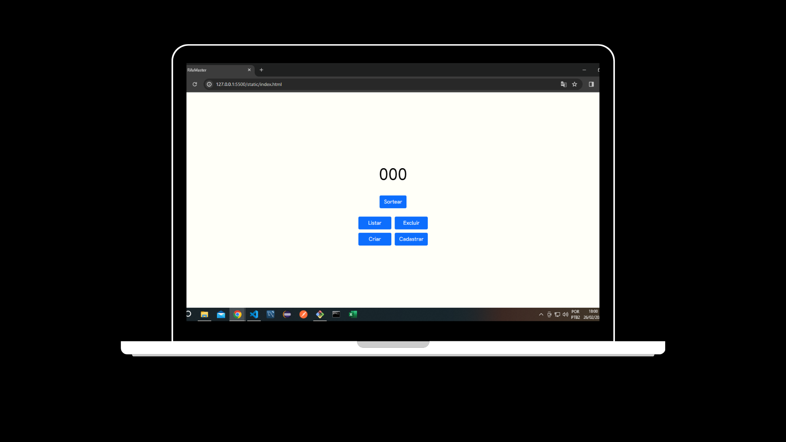

<h1>RifaMaster</h1>

Tecnologias usadas

  <li>Java 17</li>
  <li>Spring Boot</li>
  <li>MySQL</li>
  <li>Bootstrap</li>
  <li>Jquery</li>
  <li>Ajax</li>

<h1></h1>

O sistema oferece diversas funcionalidades, incluindo a criação de rifas de tamanhos variados, com reinicialização dos números a cada nova rifa criada. Além disso, proporciona a opção de exclusão de uma rifa, resultando na automática zeragem do seu tamanho. O cadastro de usuários na rifa é suportado, possibilitando que um usuário tenha múltiplos números associados. A funcionalidade "listar" permite a visualização de todos os números já preenchidos. Por fim, o sistema oferece a flexibilidade de realizar inúmeros sorteios em uma única rifa.

